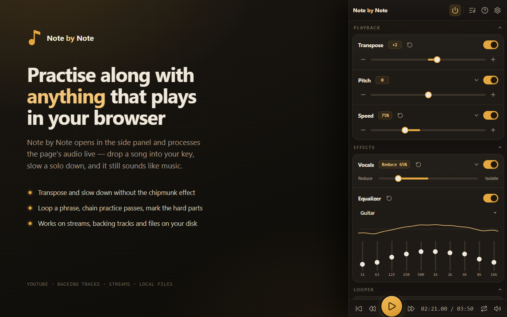

<h1 align="center">Note by Note</h1>

<p align="center">
  <a href="https://chromewebstore.google.com/detail/bifddjdeacijlelkenjkfcmlbicgoglc">
    
  </a>
  <a href="https://addons.mozilla.org/en-US/firefox/addon/note-by-note/">
    
  </a>
</p>

<p align="center">
  
</p>

Note by Note is a browser extension for practicing along with music you didn't
record: a YouTube lesson, a backing track, an mp3 on your disk. It opens in the
side panel and processes the page's audio in real time, so you can drop a song
into your instrument's key, slow a solo to half speed without the chipmunk
effect, and loop four bars until they stick.


Chrome 116+ and Firefox 140+ (MV3, side panel). Built with
[WXT](https://wxt.dev), Svelte 5 and
TypeScript; pitch and time-stretching come from the
[Rubber Band Library](https://breakfastquay.com/rubberband/) realtime R3 engine,
compiled to a WASM AudioWorklet.

## Features

**Pitch and speed.** Transpose ±12 semitones, or ±36 with extended range turned
on. Fine-tune in cents, or pin everything to a reference pitch if you're playing
with a Baroque group at 415 Hz. Speed runs 25–200% and leaves pitch where it is.

**Practice structure.** Drop markers on the timeline, set a loop range, add a
count-in. Clicking a marker tile loops its section; dragging across tiles (or
Shift-clicking a second one) loops every section between them. Any loop can be
saved as a *snippet*, and snippets chain into *sequences*: play the solo at 50%,
then 75%, then full speed, repeating each a set number of times, without
touching the panel between passes.

**Sound.** A vocal reducer (STFT center-cut, written for this project) pushes
the center-panned voice down so the band comes forward. There's also a 10-band
EQ with saveable presets.

**Chords.** Optional chord and key detection runs a BTC model over the audio and
draws a chart under the timeline.

**Keeping your place.** Settings are stored per track against a normalized URL,
so reopening a video brings back its pitch, speed, markers, loops and snippets —
however you open it, not just from the library. Favorites and
recents live in a library tab, and optional cross-device sync carries saved practice data and favorites
to your other browsers through the browser's own sync — no server, no account.

## Installing it

<table>
  <tr>
    <td width="72" align="center">
      <a href="https://chromewebstore.google.com/detail/bifddjdeacijlelkenjkfcmlbicgoglc">
        
      </a>
    </td>
    <td>
      <b>Chrome, Edge, Brave</b><br>
      <a href="https://chromewebstore.google.com/detail/bifddjdeacijlelkenjkfcmlbicgoglc">Install from the Chrome Web Store</a>
    </td>
  </tr>
  <tr>
    <td width="72" align="center">
      <a href="https://addons.mozilla.org/en-US/firefox/addon/note-by-note/">
        
      </a>
    </td>
    <td>
      <b>Firefox</b><br>
      <a href="https://addons.mozilla.org/en-US/firefox/addon/note-by-note/">Install from Firefox Add-ons</a>
    </td>
  </tr>
</table>

Or build it yourself and load it unpacked:

```powershell
pnpm install ; pnpm build
```

Then open `chrome://extensions`, turn on **Developer mode**, choose **Load
unpacked**, and pick `.output/chrome-mv3`.

## Running it locally

```powershell
pnpm install   # postinstall generates the worklet bundles and WXT types
pnpm dev       # launches Chrome with the extension loaded, HMR on
pnpm check     # svelte-check / TypeScript; this is the type gate
pnpm build     # production build → .output/chrome-mv3
pnpm zip       # store package
```

`pnpm install` isn't optional before touching anything audio-related: the
worklet bundles are generated, not committed.

`WXT_NO_LAUNCH=1 pnpm dev` skips the launched browser so you can load
`.output/chrome-mv3` unpacked in your own Chrome instead. HMR still connects.

To work on the UI without an extension context, build, serve
`.output/chrome-mv3` statically, and open `sidepanel.html?mock=1` — mock data
plus an in-memory `chrome` shim.

`pnpm dev:firefox` / `pnpm build:firefox` / `pnpm zip:firefox` build the
Firefox 140+ add-on (`.output/firefox-mv3`); it has no tab-capture fallback, and
Chrome is what the E2E harness drives, so smoke-test it by hand after touching
the engine.

## Tests

`pnpm test:dsp` runs the unit tests under `node --test`: the center-cut
math, the CQT, chord decoding, library migration, merge rules, backups and independent sync records. Fast, no browser.

The e2e harness is the interesting one. It launches Chrome for Testing with the
extension installed, plays a 440 Hz tone, and asserts on the *processed output* —
+12 semitones has to come back at 880 Hz. It also covers loop wrapping, snippet
sequences, per-track persistence across reloads, the strict-CSP fallback, and the
vocal reducer against a stereo mix.

```powershell
pnpm dlx @puppeteer/browsers install chrome@stable --path ./.browsers   # once
node e2e/make-tone.mjs ; node e2e/make-stereo-mix.mjs                   # once
pnpm wxt build --mode testing   # grants <all_urls> so no native prompt blocks the run
node e2e/run.mjs                # --headful to watch it happen
```

## Architecture

```
src/
  core/         engine, audio pipeline, messaging, model, persistence, state
  features/     one folder per feature, each with engine/ and/or panel/
  ui/           shared presentational components
  entrypoints/  WXT composition roots (sidepanel, content, background, offscreen, local-player)
```

Vertical slices, not layers. The fact worth knowing up front: **the audio engine
lives in the page, not in the side panel.** The content script owns detection,
transport and the whole DSP chain; the panel mirrors it over a typed
`chrome.runtime` port at ~30 Hz, which is why closing the panel doesn't stop a
running sequence. Within a feature, `engine/` and `panel/` never import from each
other, and features register themselves with the composition roots rather than
the other way round.

## Before you start

- Worklet bundles land in `public/worklets/`, gitignored and generated — run
  `pnpm install` first. They rebuild on `wxt build`, but editing a
  `*.worklet.ts` mid-`pnpm dev` doesn't hot-reload; rerun the matching
  `scripts/build-*-worklet.mjs`.
- Those bundles have no `@/` alias, and neither do the `node --test` files. Both
  need relative imports, with explicit `.ts` extensions in the tests.
- One `MediaElementSourceNode` per element per document, so reloading the
  extension means reloading the page too.
- `note-by-note-center-cut` is a string literal on both sides of the worklet
  boundary — `tsc` won't catch a mismatch, you'll get an `InvalidStateError`.
- `node e2e/run.mjs` prints a pass/fail tally for the playback suite;
  `node e2e/library.mjs` (`pnpm test:e2e:library`) additionally checks concurrent
  library edits, remote updates, restart recovery and sync capacity.

## Sync

Saved practice data, favorites, EQ presets and settings sync through the browser's
own extension storage. Recent, panel layout, last-used parameters and generated
chord analysis stay on the device. Audio is never transferred.

One saved song owns its parameters, markers and snippets. Recent and Favorites
are views of that song, so there are no saved-settings copies to keep aligned.
The background is the only library writer; it handles edits, imports and remote
updates even when the panel is closed. An active practice session keeps its loaded
configuration until the song is reopened. Sync never reloads the panel.

Each song is a complete, independently compressed sync item. Practice edits and
favorite membership have separate revisions; preset deletion is an explicit null.
Revisions advance past everything a device has observed, with deterministic ties.
There is no whole-library blob and no chunk assembly. Because the browser caps
sync at 512 items, a song is kept while it is favorited, in Recent, or among the
300 most recently opened; past that it becomes a dated deletion so the removal
crosses devices, and only the newest 100 deletions are kept. If a record or
library exceeds the browser's capacity, local data remains saved and Settings
reports the error. Export a backup to transfer all data, including local history
and analysis.

Backups are readable version-4 JSON containing shared and local sections. Imports
also accept the version-1 format every released build wrote, and convert it once.
Replacing a backup replaces this device's library and dates the named changes for
sync; it does not delete songs known only to another device. Old local storage is
retained as a recovery copy after the first migration. Upgrade all devices before
using the new sync format; older builds cannot read it.

## License

GPL-2.0-or-later — see [LICENSE](LICENSE) for the full text and
[NOTICE](NOTICE) for the project's copyright and third-party notices.

The copyleft comes from Rubber Band, which is used here under its GPL option.
Anything distributed on top of this has to ship its source under the GPL as well,
and per Rubber Band's own guidance, GPL builds can't go on the iOS or macOS App
Stores. Replacing the pitch engine with a differently-licensed one is the only
way out of that.

One wrinkle worth recording, since it looks like a contradiction: the npm
package we consume, `@echogarden/rubberband-wasm`, declares `GPL-2.0-only` in
its metadata, but it ships only the bare GPLv2 text with no version-restricting
statement of its own, and upstream Rubber Band is distributed by Breakfast Quay
as GPL "version 2 or later". The npm field is over-restrictive; `-or-later` is
what actually applies.

Third-party components:

- [Rubber Band Library](https://breakfastquay.com/rubberband/) (GPL-2.0-or-later)
  — pitch shifting and time stretching, via `@echogarden/rubberband-wasm`.
- The [BTC chord-recognition model](https://github.com/jayg996/BTC-ISMIR19)
  (MIT, © 2019 Jonggwon Park) — `public/models/btc.onnx`, license text alongside
  it in [BTC-LICENSE.txt](public/models/BTC-LICENSE.txt).

The vocal reducer and the rest of the DSP in `src/` were written for this
project.
